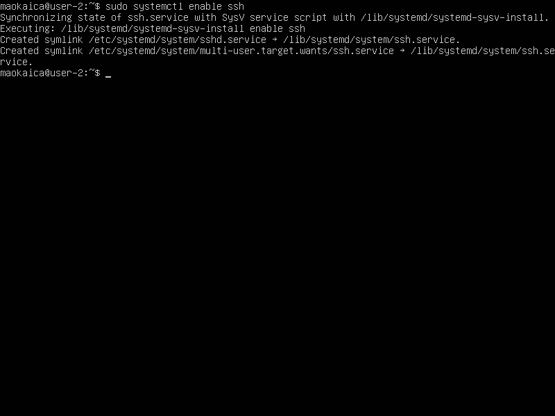
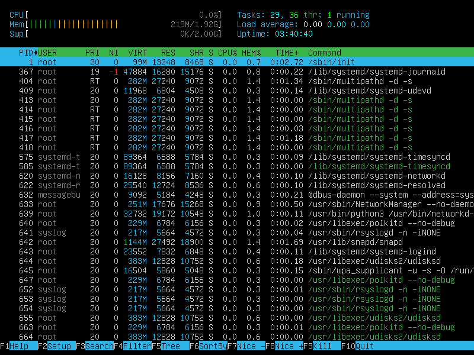
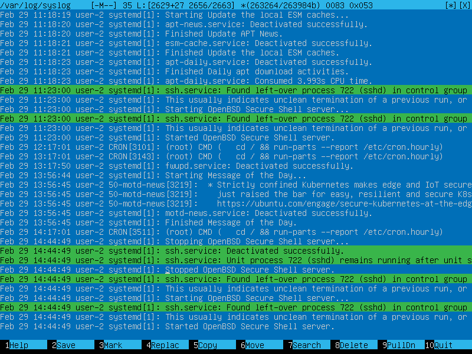

## Part 1. Installation of the OS ##

 - 
   *Ubuntu version*

## Part 2. Creating a user ##

 - 
   *Creating a user*
 - 
   *User is created*
   
## Part 3. Setting up the OS network ##

- с помощью команды sudo nano /etc/hostname поменял имя машины
 - 
   *Machine name set to user-1*
 - 
   *Ttimezone set*
 - 
   *Network interfaces*
 - Интерфейс lo (loopback) является особым виртуальным интерфейсом в сетевой подсистеме операционной системы. Он используется для установления связи между различными сетевыми приложениями, работающими на одном и том же устройстве. 
 - 
   *IP address from DHCP*
 - Протокол динамической настройки хоста. DHCP используется для автоматической настройки сетевых устройств, например компьютеров, маршрутизаторов и других устройств, в сетях TCP/IP. DHCP предоставляет устройствам IP-адрес, маску подсети, адрес шлюза, DNS-сервер и другие параметры, необходимые для подключения к сети.
 - 
   *External gateway IP*
   - Open file /etc/netplan/00-installer-config.yaml
   - Set IP, GW and public DNS manually
   - Apply changes and reboot
 - 
   *GW and IP before change*
 - 
   *DNS before change*
 - 
   *Path to configuration file*
 - 
   *Configuration file before change*
 - 
   *Configuration file after change*
 - 
   *Apply configuration*
 - 
   *GW and IP after change*
 - 
   *DNS after change*
 - 
   *Ping 1.1.1.1 result*
 - 
   *Ping ya.ru result*
 
## Part 4. OS update ##

 - 
   *All packages updated*

## Part 5. Using the sudo command ##

 - The sudo command (Superuser Do) grants a user authorities that are by default restricted for the root user for safety
 - 
 - 
 - 
   *Hostname set by user created in Part 2*
   
## Part 6. Installing and configuring the time service ##

 - 
   *Timezone synchronized*
   
## Part 7. Installing and using text editors ##

 - 
   *Nano editor. Nickname*
 - 
   *Vim editor. Nickname*
 - 
   *Joe editor. Nickname*
 - Nano: press Ctrl+s, then Ctrl+x
 - Vim: in the command line, type :wq!
 - Joe: press Ctrl + K, press X
 - 
   *Nano editor. Content changed*
 - 
   *Vim editor. Content changed*
 - 
   *Joe editor. Content changed*   
 - Nano: press Ctrl+x, then type N
 - Vim: in the command line, type :q!
 - Joe: press Ctrl + K, press D, then press n and press Enter
 - 
   *Nano editor. Search to replace*
 - 
   *Vim editor. Search to replace*
 - 
   *Joe editor. Search to replace*
 - Nano:
   - press Ctrl+\
   - type a search word, and press Enter
   - type a substitution word, and press Enter
   - select "Y" to replace all occurrences
 - Vim:
   - in the command line, type :%s/word-to-replace/substitution-word/g, and press Enter
   - (% is to search throughout the file, g is to replace all occurrences)
 - Joe:
  - press Ctrl + K, and press F
  - type a search word and select Ignore mode
  - Press Ctrl + K, and press L, select string, and search
  - If replace, select Replace mode
  - repeat 3 point, and press y
 - 
   *Nano editor. Replacement*
 - 
   *Joe editor. Replacement*
 - 
   *Vim editor. Content replaced*

## Part 8. Installing and basic setup of the SSHD service ##

 - 
  *SSH service autostart enabling*
 - To reset SSHd port: open file /etc/ssh/sshd_config, and manually change the port from 22 to 2022
 - 
   *Changing SSHd port from 22 to 2022*
 - To enable the changes, it is necessary to uncomment the line with the word "Port" and restart the sshd service
 - 
   *SSHd process presence*
 - the ps command is to view running processes:
   - the aux option is to show all processes running
   - grep command is to search the list of running processes for a patter following it (grep write into standard output each line that matches the pattern)
 - 
   *Netstat -tan output*
 - The combination -tan actually includes two arguments of thecommand tool Netstat:
   - -at is to show only TCP sockets
   - -n is to show addresses of hosts/ports/users numeriacally rather than symbolically
 - Column output explanation:
   - 1 Transmission Control Protocol
   - 2 a queue of bytes to be received
   - 3 a queue of bytes to be sent
   - 4 IP address of the local host and the port number in use
   - 5 the remote device IP the host tries to connect to
   - 6 a state of the socket (when set to LISTEN, i is listening to incomming connections)
   - 0.0.0.0 in the address means the wildcard address indicative of the device trying to get network traffic on any interface

## Part 9. Installing and using the top, htop utilities ##

 - 
   *Top utility window*
 - Uptime is 3:30; Number of authorised users: 1
 - Total system load: 0.00
 - Total number of processes: 106
 - CPU load: 0.0
 - Memory load: 218.1 MiB of 1964.6 MiB
 - The highest memory usage process PID: 1 root
 - The highest CPU time process PID: 1 root
 - 
   *Htop. Sorting by PID*
 - 
   *Htop. Sorting by PERCENT_CPU*
 - 
   *Htop. Sorting by PERCENT_MEM*
 - 
   *Htop. Sorting by TIME*
 - 
   *Htop. Filter for SSHD process*
 - 
   *Htop. Search for syslog process*
 - 
   *Htop. Hostname, clock, and uptime added*

## Part 10. Using the fdisk utility ##

 - 
   *Hard disk info*
 - Hard disk name: SDA
 - Hard disk capacity: 25 GB
 - Number of sectors: 52428800
 - Swap size: 2 GB.
 - 
   *Swap size*

## Part 11. Using the df utility ##

 - 
   *Root partition parameters in k-blocks*
 - Partition size: 11758760 K-blocks
 - Space used: 6104260 k-blocks
 - Space free: 5035392 k-blocks
 - Pecentage in use: 55%
 - Measured in k-blocks. 1k-block = 1024 bytes.
 - 
   *Root partition parameters in Gigabytes*
 - Partition size: 12 Gb
 - Space used: 5.9 Gb
 - Space free: 4.9 Gb
 - Percentage in use: 55%
 - Measured in Gbytes. 1 Gigabyte = 1,048,576 bytes

## Part 12. Using the du utility ##

 - 
   *Home directory size in bytes*
 - 
   *Var/log directory content size in bytes*
   
## Part 13. Installing and using the ncdu utility ##

 - 
   *Home directory size*
 - 
   *Var directory content size*
 - 
   *Var/log directory content size*
   
## Part 14. Working with system logs ##

 - 
   *Last successful login*
 - Last successful login: time is 29 Feb 09:19:48, maokaica, password-login method
 - 
   *SSHd restart, auth.log*
 - 
   *SSHd restart, syslog*
   
## Part 15. Using the CRON job scheduler ##

 - 
   *Uptime in 2 minutes via CRON*
 - 
   *CRON jobs*
 - 
   *Removal of CRON jobs*
